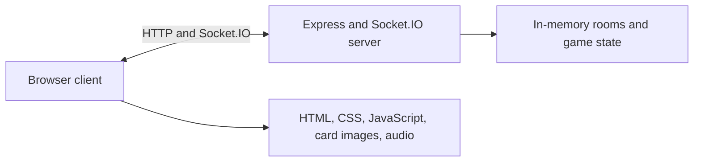

# 🎴 UNO Arena

**A real-time multiplayer UNO-style card game for 2–4 players.** Create a room, invite players with a room code, and play from a responsive card table with live turns, UNO calls, draw-four challenges, and sound.


## Contents

- [Features](#features)
- [Run locally](#run-locally)
- [How a match works](#how-a-match-works)
- [Architecture](#architecture)
- [Card model and rules](#card-model-and-rules)
- [Socket.IO protocol](#socketio-protocol)
- [Assets and audio credits](#assets-and-audio-credits)
- [Operational notes](#operational-notes)
- [License](#license)

## Features

- Create and join multiplayer rooms over Socket.IO.
- Start a match when at least two players are in the room. The interface has four seats and is intended for two to four players.
- Keep game rules on the server: turn ownership, hand contents, playable-card validation, direction, draw effects, UNO state, and draw-four challenges.
- Show each player their own hand while sending opponents’ card counts to clients.
- Render player seats on the top, bottom, left, and right of the table. Card hands stay within fixed-size trays and scroll when needed.
- Use fluid responsive sizing within the single `max-width: 1500px` CSS media query. On supported small screens, the game asks for landscape orientation.
- Play a looping music track and short UI/game effects. Sound can be toggled from the speaker button and the preference is saved in local storage.
- Resume a disconnected player’s room session for up to 30 seconds.

## Run locally

### Requirements

- Node.js 18 or newer
- npm

### Install and start

```bash
cd backend
npm install
node server.js
```

Open [http://localhost:3000](http://localhost:3000). The backend serves the frontend and Socket.IO from the same origin; no frontend build step or separate development server is needed.

To play with another device on the same network, open `http://<host-ip>:3000` on that device and allow inbound connections to port `3000` in the host firewall if needed.

There is no `npm start` script in the current package manifest. The server listens on port `3000`, defined in `backend/server.js`.

## How a match works

1. A player creates a room and enters a display name. The server returns a numeric room code.
2. Other players join with that code and their display names.
3. The room host starts the match once at least two players have joined.
4. The server deals seven cards to each player, selects a valid initial number card, and sends each client its own hand plus public match state.
5. Players play a card or draw. Wild cards open a color-selection prompt; a Wild Draw Four gives the next player a challenge-or-accept choice.
6. A player who reaches one card can call UNO. Other players can catch an undeclared UNO and apply the two-card penalty.
7. When a player empties their hand, the server announces the winner and the client displays the round-complete overlay.

## Architecture



### Repository layout

```text
.
├── backend/
│   ├── package.json          # Express and Socket.IO dependencies
│   ├── package-lock.json
│   └── server.js             # Static hosting, room lifecycle, and game rules
└── frontend/
    ├── index.html            # Page shell and script loading order
    ├── index.js              # Socket connection, room UI, local session handling
    ├── game.js               # Table rendering and game interaction
    ├── audio.js              # Music, effects, and sound toggle
    ├── styles.css            # Table, card trays, and responsive presentation
    ├── card-back.png
    ├── CardsFront/           # Card-face PNGs addressed by card code
    ├── audio/                # Local music and sound effects
    └── vendor/
        └── socket.io.min.js  # Browser Socket.IO client
```

### Server and client responsibilities

- **`backend/server.js`** creates an HTTP server, serves `frontend/` with Express, attaches Socket.IO, and owns room membership and authoritative match state. It validates a played card against the current hand, current player, and active card/color before applying the move.
- **`frontend/index.js`** connects the browser to Socket.IO, prompts for names and room codes, renders the lobby, and stores the session ID, player name, room code, and phase in `localStorage`.
- **`frontend/game.js`** turns server messages into the table UI: player seats, card stacks, status text, UNO controls, color selection, draw-four decisions, toasts, and the winner overlay.
- **`frontend/audio.js`** plays local audio files, starts background music after the first user interaction (required by browser autoplay rules), and adds the persistent sound toggle.
- **`frontend/styles.css`** styles the lobby and four-seat table. The card trays have fixed bounds with overflow scrolling, so adding cards does not expand the table.

The browser receives a player’s own card codes in `yourCards`. Other players are represented by `{ name, count }`; their hands are not included in the public game-state payload.

## Card model and rules

The server builds a 108-card deck with four colors: red (`R`), yellow (`Y`), green (`G`), and blue (`B`). Number cards use their digit and color as the code; action-card codes are:

| Card | Code pattern | Effect |
| --- | --- | --- |
| Number | `0R`–`9R` (and other color suffixes) | Match the current color or number. |
| Skip | `skipR` | Skip the next player. |
| Reverse | `_R` | Reverse turn direction. In a two-player match, the next turn is skipped. |
| Draw Two | `D2R` | The next player draws two cards and is skipped. |
| Wild | `W` | Choose the color that play continues with. |
| Wild Draw Four | `D4W` | Choose the next color and give the next player a challenge-or-accept decision. |

Colored card image names match the server card codes in `frontend/CardsFront/`. `W` and `D4W` are the two wild-card image names; `card-back.png` is used for hidden opponent cards and the draw pile.

The server accepts a Wild Draw Four challenge when the player who played it had a card matching the previous color. On a successful challenge, the offender draws four and the challenger plays; on a failed challenge, the challenger draws six and loses that turn. Stacking draw cards is not implemented.

## Socket.IO protocol

The browser and server exchange named Socket.IO events. The server is authoritative: clients request actions, then render the state the server sends back.

### Client → server

| Event | Payload | Purpose |
| --- | --- | --- |
| `createRoom` | `{ host, sessionId }` | Create a room and set its host. |
| `joinRoom` | `{ player, code, sessionId }` | Join an existing lobby. |
| `startGame` | — | Start a match as the room host. |
| `playedCard` | `{ card, index }` | Request to play a card from the local hand. |
| `drawCard` | — | Draw one card on the current turn. |
| `passTurn` | — | End a turn after drawing. |
| `colorChosen` | `R`, `G`, `B`, or `Y` | Select the color for a Wild card. |
| `drawFourDecision` | `{ challenge: boolean }` | Challenge or accept a Wild Draw Four. |
| `callUno` | — | Declare UNO. |
| `catchUno` | — | Catch another player who did not declare UNO. |
| `leaveRoom` | — | Leave the current room. |
| `resumeSession` | `{ roomCode, sessionId }` | Reconnect a saved session. |

### Server → client

| Event | Purpose |
| --- | --- |
| `createRoom`, `player_list_update` | Return room details or refresh the lobby roster. |
| `gameStarted` | Send the opening hand and initial card after a match starts. |
| `game_state` | Send the latest public state and the recipient’s own hand. |
| `drawn_state` | Send updated state to the player who drew a card. |
| `chooseColor`, `draw_four_pending` | Open a pending Wild color choice or Wild Draw Four decision. |
| `draw_four_result` | Announce the outcome of a challenge. |
| `uno_called`, `uno_penalty` | Announce UNO calls and penalties. |
| `game_over` | Announce the winner. |
| `room_error`, `session_expired`, `redirect_to_index` | Report lobby/session errors or navigate back to the lobby. |

`game_state` includes the room code, current card/color, current turn, draw/play availability, player names and counts, UNO action flags, and the recipient’s hand. `drawn_state` uses the same shape, with a separate event name so the drawing player can show the pass action.

## Assets and audio credits

Audio assets are served locally from `frontend/audio/`:

- **“Happy Loop” by wipics** — background music, from [OpenGameArt](https://opengameart.org/content/happy-loop), CC0 / public domain.
- **Card Game sounds by HaelDB** — interface and card effects, from [OpenGameArt](https://opengameart.org/content/card-game-sounds), CC0.

The project’s audio source notes are in [`frontend/audio/README.md`](frontend/audio/README.md). The browser starts music after a user gesture and remembers the sound-toggle preference on that browser.

## Operational notes

- **State is in memory.** Rooms, games, and disconnect timers live in server-side JavaScript objects. Restarting the server clears all active rooms and matches; there is no database or persistence layer.
- **Reconnect window is 30 seconds.** The server retains a disconnected player during this grace period. The browser’s session record is stored locally and is specific to that browser profile.
- **Seat count is fixed in the UI.** The board renders four seats. The lobby requires at least two players to start, but the backend does not currently enforce a maximum; keep rooms to four players or fewer.
- **Room codes are short numeric identifiers.** They are convenient for casual room invites, not authentication credentials.
- **Port configuration is currently fixed.** Change `PORT` in `backend/server.js` if port `3000` is unavailable; no environment-variable configuration is currently provided.
- **Phone orientation.** On small/coarse-pointer screens, the game table is locked while the device is in portrait orientation; rotate the device to play.
- **Audio playback.** Browsers block autoplay until the user interacts with the page. The game starts its music after that interaction; the speaker button can mute or restore all audio.

## License

There is currently no root-level `LICENSE` file specifying a license for the application source. The audio assets have the separate CC0 terms listed above and in `frontend/audio/README.md`.
